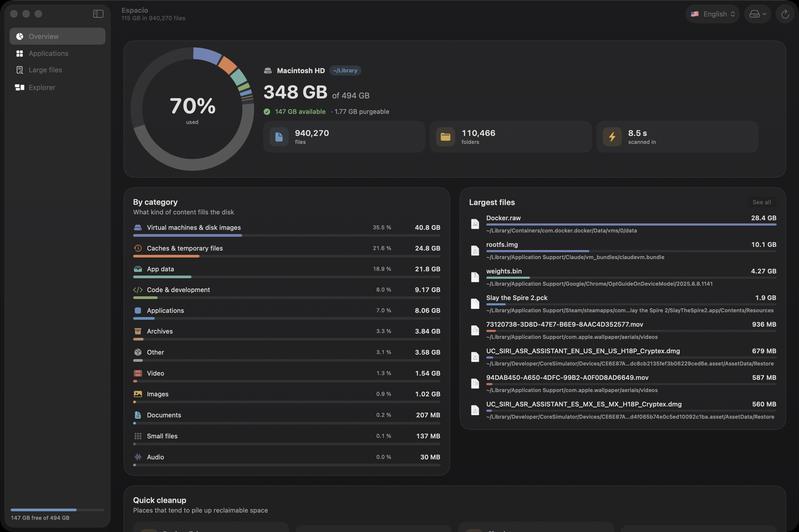
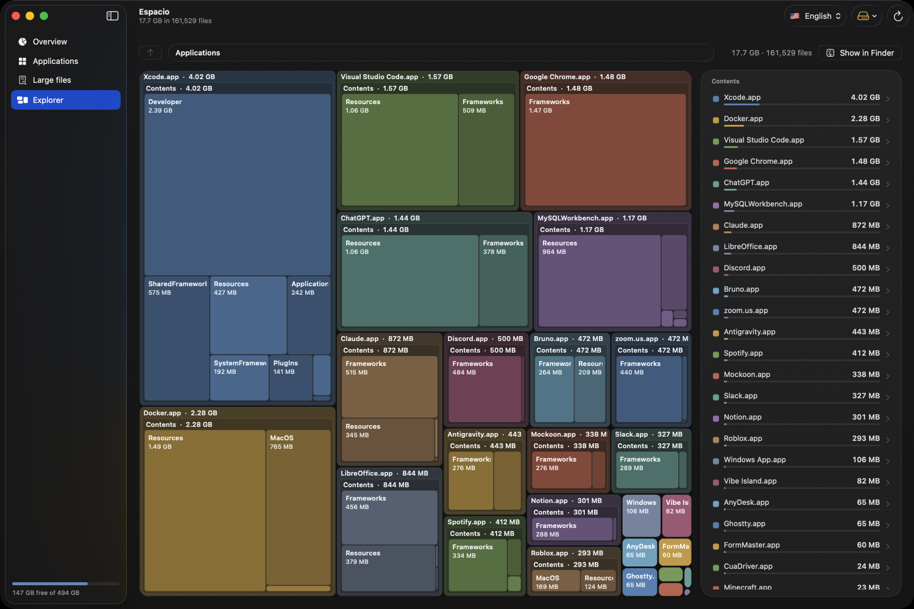

# Espacio

A fast, good-looking disk analyzer and app uninstaller for macOS. Find what is
eating your disk, see it as a treemap, and get the space back. Everything you
remove goes to the Trash, never straight to oblivion.

**[Download Espacio.dmg](https://github.com/manu515256/espacio-app/releases/latest/download/Espacio.dmg)** · macOS 26 (Tahoe) or later · Apple Silicon

*También en español: cambiá el idioma desde el menú 🇺🇸 / 🇪🇸 de la barra superior.*



## What it does

- **Overview.** A ring of disk usage by category (apps, video, code, caches, VMs…),
  the largest files, and a *Quick cleanup* list of places that pile up
  reclaimable space: `Docker.raw`, Xcode DerivedData and device symbols, iOS
  simulators, npm / pnpm / Yarn / Homebrew / Cargo / Gradle caches, iPhone
  backups, logs, the Trash itself.
- **Applications.** Every app in `/Applications` and `~/Applications` with its
  size, version and last use. Pick one and Espacio finds its leftovers
  (Application Support, Caches, Preferences, Containers, Saved State, Logs,
  Launch Agents, WebKit data…) so you can uninstall the app and its remains in
  one click. Apps owned by root are handed to Finder, which asks for your password.
- **Large files.** The 2,000 heaviest files on the volume, filterable by type,
  searchable, multi-select, with Finder / open / trash actions.
- **Explorer.** An interactive squarified treemap. Click a folder to dive in,
  hover for details, right-click for actions, breadcrumbs to go back up.



## Why it is fast

- It walks the volume with `getattrlistbulk(2)`, the same syscall Finder uses:
  one call returns name, type, allocated size, modification time and inode for
  hundreds of directory entries, so there is no `stat` per file.
- A pool of 12 threads shares a LIFO work queue and each thread keeps descending
  into the last subfolder it read without touching the lock.
- Sizes are *allocated* bytes (`ATTR_FILE_ALLOCSIZE`), so compressed, sparse and
  not-yet-downloaded iCloud files count what they really occupy. Hard links are
  counted once; other volumes and the firmlinked data volume are skipped so
  nothing is double counted.
- Files under 64 KB are folded into one aggregate node per folder, which keeps
  memory flat on volumes with millions of files.

Measured on an Apple Silicon MacBook Pro: 5.0 M files / 928 K folders / 435 GB
in about 30 s with a cold cache, using ~270 MB of RAM. `~/Documents` with 1.7 M
files took 6 s where `du -s` needed 30 s.

## Install

1. Download [Espacio.dmg](https://github.com/manu515256/espacio-app/releases/latest/download/Espacio.dmg),
   open it and drag **Espacio** to **Applications**.
2. The app is signed ad hoc and not notarized (there is no paid Apple developer
   account behind it), so the first launch shows "Apple could not verify…".
   Right-click the app and choose **Open**, or go to *System Settings › Privacy &
   Security* and click **Open Anyway**. From a terminal this does the same:

   ```bash
   xattr -d com.apple.quarantine /Applications/Espacio.app
   ```

3. Grant **Full Disk Access** when the app suggests it. Without it macOS hides
   Mail, Safari, Messages and a few other folders; Espacio tells you how many
   folders it could not read and opens the right settings pane.

## Safety

- Every removal is a move to the Trash. You can always put things back.
- Emptying the Trash is delegated to Finder and always asks first.
- Uninstalling an app quits it first if it is running.
- The *Quick cleanup* hints tell you when a proper command exists
  (`docker system prune -a`, `xcrun simctl delete unavailable`, `brew cleanup`…)
  instead of deleting blindly.

## Build from source

Requirements: macOS 26 and Xcode 26 (Swift 6.3). No third-party dependencies.

```bash
./scripts/build-app.sh     # build/Espacio.app (SwiftPM + ad-hoc signature)
./scripts/make-dmg.sh      # build/Espacio-<version>.dmg
open build/Espacio.app
```

To work in Xcode, generate the project from `project.yml`:

```bash
brew install xcodegen
xcodegen generate
open Espacio.xcodeproj
```

Engine-only benchmark, no UI:

```bash
.build/release/Espacio --bench ~/Documents
```

Layout:

```
Sources/Espacio/
  Scanner/    FSNode, DiskScanner (getattrlistbulk + thread pool), TopFiles (heap)
  Apps/       AppInventory (apps and their leftovers)
  Services/   TrashService (Trash, Finder fallback, reveal)
  Support/    ByteFormat, FileCategory, Localization
  App/        AppState (@Observable model), EspacioApp, Bench, Snapshot
  UI/         Overview, Apps, LargestFiles, Explorer + Treemap, Components
  Resources/  Localizable.xcstrings (string catalog, es + en)
scripts/      build-app.sh, make-dmg.sh, make-icon.swift
```

## Localization

English and Spanish, switchable at runtime from the toolbar menu. Strings live
in `Sources/Espacio/Resources/Localizable.xcstrings` (source language Spanish,
English translations). Code calls `L("key")` or `L("key %@", args)`; numbers,
dates and percentages follow the chosen locale. To add a language, add a case to
`AppLanguage` and the translations to the catalog.

## License

[MIT](LICENSE) © 2026 Manuel Doña
